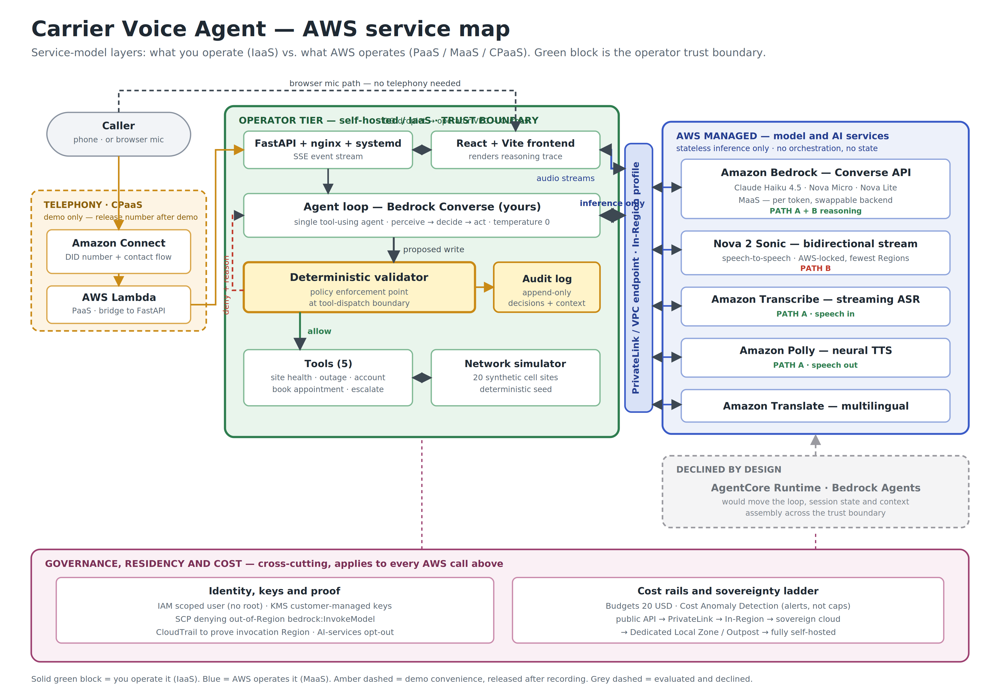
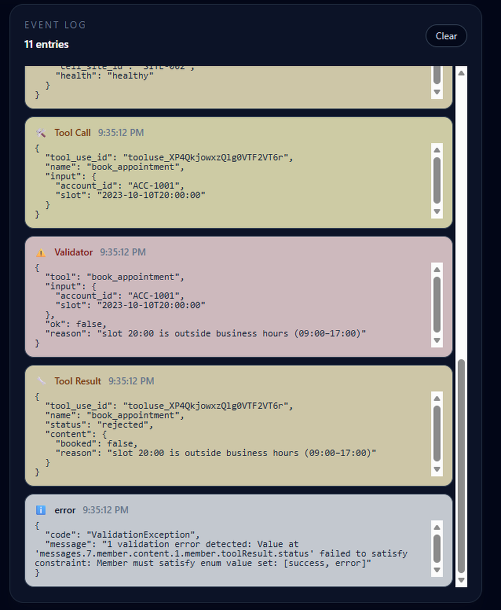
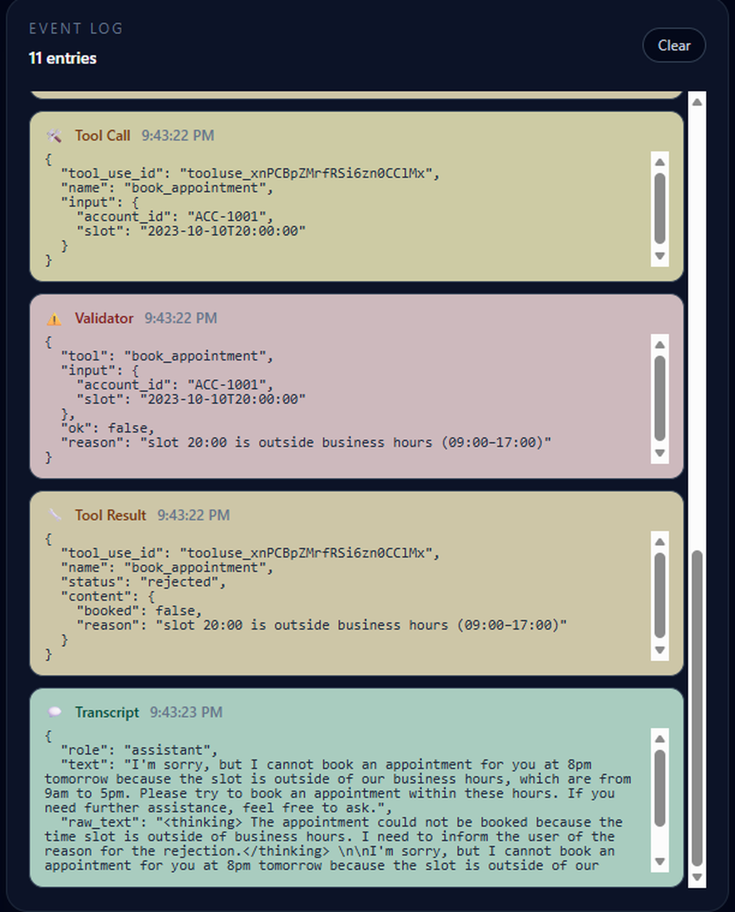

# Carrier Voice Agent
**Network-aware, hybrid-cloud voice AI for telecom care — built on AWS Bedrock.**

An agentic voice pipeline for telecom customer care. It answers a call, checks the state of the network before it responds, and speaks back — gating anything that touches a customer record behind a deterministic validator.


**Status: the text agent works.** It runs on real Bedrock inference — Nova Micro reasoning over the tool schema, with the validator gating writes. Voice is the natural next step but is not built.

Live demo: https://carrier.sireenmalik.online/

**Application** — Python 3.12 · FastAPI · Server-Sent Events · React + TypeScript · Vite · nginx · systemd · GitHub Actions CI/CD · Let's Encrypt

**AWS** — Bedrock (Converse API, tool use) · IAM least-privilege service identity · Budgets · Cost Anomaly Detection · cross-region inference profiles

**Architecture** — single tool-using agent loop · deterministic policy-enforcement gate on writes · Return-of-Control pattern · confidence routing to human escalation · data residency and sovereignty ladder (KMS, CloudTrail, Service Control Policies, PrivateLink / VPC endpoints) · two-path design comparison on portability and failure modes.

## Models and what each one does

The three text models are not three roles — they are three candidates for the same slot. Exactly one runs the reasoning loop at a time; the others exist so the choice is measured rather than asserted.

| Model | Role in the pipeline |
|---|---|
| **Amazon Nova Micro** | Runs the reasoning loop today: reads the caller's turn, decides which tool to call and with what arguments, then writes the spoken reply. Cheapest tier, text-only — and fixed-schema tool selection is essentially the classification-and-routing job it is built for. |
| **Amazon Nova Lite** | Same job, one step up from Micro — the step-up candidate if Micro misfires on ambiguous or accented phrasing. |
| **Claude Haiku 4.5** | Same job again, and the reference point for tool-call accuracy on hard, accented input — the step-up candidate when accuracy outweighs cost. |
| **Amazon Nova 2 Sonic** | Path B in a single model: caller audio in, reasoning and tool calling, agent audio out — collapsing the entire Transcribe → Bedrock → Polly chain into one bidirectional stream. |
| **Amazon Transcribe** | Path A speech-in: streams caller audio to text so the text model has something to reason over. |
| **Amazon Polly** | Path A speech-out: turns the agent's text reply into neural speech. |
| **Amazon Translate** | Renders turns across languages for non-English callers. Being tested against letting the reasoning model translate inline. |

Path A is four components you assemble and can place independently. Path B is one component you cannot take apart. That is why their latency and sovereignty tradeoffs should diverge: Path A pays serialization cost at every hop but each hop is yours to move, while Path B is faster with no text intermediate but is a single AWS-locked box.

In progress: Transcribe and Polly voice layer (Path A) · Nova 2 Sonic speech-to-speech (Path B) · Translate for multilingual callers.
## The argument

Every agentic voice demo in telecom care apologizes for an outage it cannot see. A care agent that answers "I understand you're frustrated, let me help you troubleshoot your device" while the caller's tower is in maintenance is not being helpful — it is being wrong at scale. The network is the product. A care response that ignores the state of the network is the wrong response.

This repo is an argument in code: the reasoning loop must consult network health before it speaks. Cell site status is a first-class input to the model's tool set, not an afterthought handed off to a separate ticket queue. Everything else here — telephony, transcription, TTS, translation — is plumbing around that one commitment.

## What it does



The green block is the operator trust boundary. Everything that reasons, decides, gates, or touches a customer record runs there — the agent loop, the deterministic validator, the tool layer, the audit log. The AWS block holds no orchestration and no session state; it serves stateless inference. One controlled hop crosses between them, and that is the hop you pin to a single Region and enforce with a service control policy.

That separation is what makes the model a swappable backend. It is also why the managed agent runtimes appear on the diagram as *declined* rather than omitted — see [The loop and the gate](#the-loop-and-the-gate).

## Seeing the argument

Two captures from the live demo showing the core claim in action. The demo's left panel has one-click **example prompts** — the outage, degraded-tower, blocked-write, and maintenance-window flows — that fill the turn box so you can reproduce each without typing.



*Chained tool calls — account → serving cell site → site health — so the agent knows the tower is degraded before it answers. Reproducible via the "Degraded tower" example prompt.*



*A write proposal blocked by the validator, with the reason surfaced to the caller — reproducible via the "Blocked write" example prompt.*

## The loop and the gate

**This is an agent. It is not a Bedrock Agent.** Those are different words wearing the same costume. An agent is an LLM in a perceive–decide–act loop over tools — which is exactly what runs here. Bedrock Agents is AWS's managed runtime that runs such a loop *for you*. This repo declines the product, not the pattern.

Specifically: **a single tool-using agent — a Bedrock Converse loop we own — with a deterministic policy-enforcement gate on writes.** One reasoning loop, one locus of decision. The tools are functions and the validator is a gate; neither reasons. The deployment is distributed; the cognition is not.

**Where the validator sits.** In the harness, at the tool-dispatch boundary — between "the model proposed this call" and "the handler mutates a record." It is *not* exposed as a tool in the schema, because a tool is something the model can choose not to call. It is middleware: a wall the request hits, not an instrument the model picks up. Enforcement does not depend on model cooperation.

```python
def dispatch_tool(name, args, context):
    if name in WRITE_TOOLS:
        decision = validator.check(name, args, context)   # deterministic, pure
        emit_sse("validator_decision", decision)          # audit event
        if not decision.allowed:
            return tool_result(name, {"status": "rejected", "reason": decision.reason})
    return tool_result(name, TOOL_HANDLERS[name](args))
```

Reads pass straight through. Writes are gated. A denial returns a structured rejection back into the loop rather than crashing, so the agent can explain, offer an alternative, or escalate — and after N rejected writes in a turn, escalation is forced so it cannot spin.

**This is a known pattern, not an invention.** It is the hand-rolled form of Return of Control in Bedrock Agents, where the runtime hands a proposed action back to the application for validation before execution. AWS's Well-Architected Agentic AI Lens prescribes the same two properties this repo claims: implement the gate as *deterministic logic rather than an LLM*, and persist full decision context for audit.

**It is not Bedrock Guardrails.** Guardrails is a model-tier content filter — it keeps the model from *saying* something bad. This is an app-tier business-policy gate on state mutations — it keeps the model from *doing* something bad to a record. Complementary, different tiers.

**Why hand-rolled.** Owning the loop is what keeps the model swappable, keeps context assembly and session state inside the operator boundary, and makes the reasoning trace ours to emit and persist in our own schema. The cost is real and named in [Where it breaks](#where-it-breaks).

## How it is auditable

The model's reasoning is not auditable, and this repo does not claim it is. Temperature 0 reduces variance without guaranteeing identical outputs, and you cannot fully explain why a model picked a tool.

What makes the system auditable is that the audit boundary sits where consequences happen, not where cognition happens:

- **Reproducible.** The validator is a pure function. Same input, same decision, replayable next year. You can point at the rule that fired.
- **Single chokepoint.** Every write funnels through one place, which is the natural point to emit one immutable record per decision — proposed action, arguments, rule evaluated, allow/deny, timestamp, originating transcript turn.
- **Bounded blast radius.** The model may propose anything. Nothing reaches a record without clearing a gate that can be explained and replayed.

## Tools the agent can call

- `get_site_health(cell_site_id)` — `degraded | healthy | maintenance`
- `get_account_status(account_id)` — plan, balance
- `lookup_outage(zip_code)` — active incidents
- `book_appointment(account_id, slot)` — **write path, gated by validator**
- `escalate_to_human(reason)` — routes out on low confidence

Tool schema is fixed. Temperature 0 for tool-calling. Network data is a synthetic simulator (twenty sites, deterministic seed) — the point is the pattern, not the data.

## The two paths

**Path A — Cascaded.** Transcribe streaming → Bedrock with tool use → Polly. Translation in the pipeline for non-English callers. Every hop is yours to place.

**Path B — Speech-to-speech.** A single audio-in / audio-out model (Nova 2 Sonic) over a bidirectional stream. No text intermediate.

Both share the same tool schema and the same validator at the same dispatch boundary — that is what makes the comparison honest rather than two unrelated demos.

The cascaded path assembles Transcribe, Bedrock and Polly, and each hop can be placed independently. The speech-to-speech path is one model that cannot be taken apart, which makes it faster but far less portable.

Portability is the axis most comparisons miss. The text path is portable: swap in a self-hosted open-weight model behind the same tool schema and the validator never notices. The speech-to-speech path is AWS-locked, available in few Regions, and cannot be self-hosted — so in a jurisdiction without a supporting Region, Path B cannot be localized at all.

## Model selection

Because the model is a swappable backend, swapping costs nothing but a config change. **Nova Micro runs the loop today** — the cheapest tier, and temp-0 tool calling against a fixed schema is an easy task that does not need a frontier model. **Nova Lite** and **Claude Haiku 4.5** are the step-up candidates if tool-call accuracy on ambiguous or accented input proves insufficient.

The validator backstops the *write* path regardless of which model proposed the call — but it does not govern reads, routing, or escalation, so model quality still matters where the gate does not reach.

## Where it runs

The app tier runs on a $4 DigitalOcean droplet standing in for an operator's own cloud; AWS services are called as APIs. That is deliberate, and it generalizes: because orchestration and the gate live in code we own, the model can slide along a privacy ladder without touching application logic.

| Rung | What it buys |
|------|--------------|
| Public API | Baseline. Encrypted in transit; no training on prompts |
| PrivateLink / VPC endpoint | Traffic never traverses the public internet |
| In-Region inference profile | Processing confined to one Region, provable via CloudTrail |
| Sovereign cloud | In-jurisdiction operation and legal boundary |
| Dedicated Local Zone / Outpost | AWS hardware in the operator's own facility |
| Self-hosted model | Inference on operator-controlled compute |

Context — the transcript, tool results, and injected account data — is assembled and held **in our own process, on our own compute**. Only a copy leaves, and only for inference. A managed agent runtime would invert this: context assembly and session state would become vendor-held artifacts.

Residency is enforced, not merely configured: an SCP denying `bedrock:InvokeModel` outside approved Regions, the Organizations AI-services opt-out policy, KMS customer-managed keys, and CloudTrail as the proof of where a call actually ran.

## Where it breaks

- **Latency budget.** The cascaded path adds Transcribe, Bedrock and Polly hops. Sub-second turn latency is not realistic with tool calls; expect 1.5–3s. S2S should be faster, but tool round-trips still cost.
- **Accented speech.** Streaming Transcribe WER climbs on accented English. The cascaded path degrades gracefully — garbled text still triggers escalation. S2S failure modes are less legible.
- **Validator rejections.** When a write is blocked the agent says so out loud rather than silently swallowing the intent. This is a feature. It also means the caller hears "I can't book that for you" more often than a demo would like.
- **Simulator, not a network.** Site health is synthetic. Real integration is a different project.
- **Connect is a demo convenience, not carrier telephony.** A real operator already owns PSTN/IMS interconnect and would bridge its own session border controller to the agent rather than route calls through Connect.
- **Managed runtime declined on purpose.** Hand-rolling the loop means owning multi-turn state, tool round-trips, and retry handling — more code and more edge cases. The trade buys portability and operational sovereignty.
- **Private networking is not operational sovereignty.** PrivateLink and In-Region profiles keep context off the public internet and inside one Region. They do not change the fact that inference runs transiently on AWS-operated hardware. Only self-hosting clears that bar.
- **Newest models and strictest residency can conflict.** Some models ship as inference-profile-only, which routes within a geography rather than a single Region. Sometimes you choose between the freshest model and the tightest residency claim.
- **Budget alerts are not caps.** AWS budgets and anomaly detection email you; they do not stop spend.
- **Text only, so far.** Real Bedrock reasoning is live on the text path; the voice layers (Transcribe, Polly, Nova 2 Sonic) are not yet wired.
- **Small model, visible seams.** Nova Micro is the cheapest tier and it shows — it emits reasoning artifacts that have to be stripped before speech, and tool-argument accuracy on ambiguous input is exactly why Nova Lite and Claude Haiku 4.5 stand ready as step-ups.

## Setup

> This section is intentionally last.

Requires: an AWS account with Bedrock model access in `us-west-2` (and Transcribe, Polly, Translate for the voice paths). Node 20 for the frontend, Python 3.12 for the validator and simulator.

```bash
cp .env.example .env  # AWS region, Bedrock model ids
python -m venv .venv && source .venv/bin/activate
pip install -r requirements.txt
cd frontend && npm install && npm run dev
```

`BEDROCK_MODEL_ID_TEXT` must be the **inference profile ID** (the `us.`-prefixed form), not the bare model ID — newer models reject on-demand invocation by base ID. Credentials come from environment variables only; nothing sensitive belongs in this repo.

Colocate the app tier and the model Region — this deployment runs the droplet in SFO against us-west-2.

Set an AWS budget alert at $20 and enable Cost Anomaly Detection before provisioning anything.

## Data and scope

Synthetic data only. No real customer data, no real network telemetry, no operator-internal architecture. The simulator is twenty fictional cell sites on a deterministic seed. Public AWS services and public patterns throughout.

## License

MIT. See [LICENSE](LICENSE).
